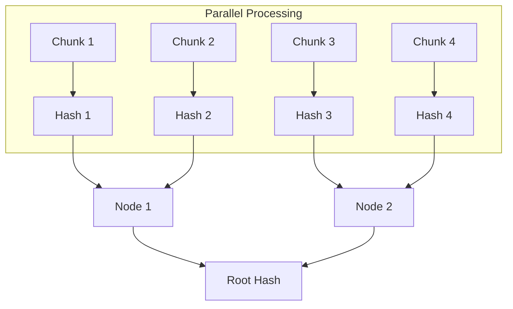

import { Callout } from 'fumadocs-ui/components/callout';
import { TypeTable } from 'fumadocs-ui/components/type-table';
import { Tab, Tabs } from 'fumadocs-ui/components/tabs';

**BLAKE3** is a cryptographic hash function that is roughly **15x faster** than SHA-2 on modern processors, while maintaining a high security margin.

## Table of Contents

- [Theory](#theory)
- [Class: Blake3](#class-blake3)
- [Real-World Examples](#real-world-examples)

## Theory

Unlike MD5 or SHA-2 which process data sequentially, BLAKE3 uses a **Merkle Tree**.
*   The data stream is cut into 1 KiB chunks.
*   Each chunk is hashed independently.
*   Each chunk is hashed independently.
*   The hashes are combined in a binary tree.



This structure allows massive parallelism (using SIMD instructions like AVX2/NEON), enabling multi-GB/s throughput.

It naturally supports:
*   **Keyed Hashing**: Acts as a MAC without HMAC construction overhead.
*   **Key Derivation**: Using "context strings" to separate domains.
*   **XOF**: Extendable Output Function (variable length output).

---

## Class: Blake3

### createBlake3([options])

Creates a `Blake3` instance.

**Parameters:**

<TypeTable
  type={{
    options: { description: 'Configuration.', type: 'Object' },
    'options.key': { 
        description: '32-byte key. Enables Keyed-Hash (MAC) mode.', 
        type: 'Buffer | TypedArray' 
    },
    'options.context': { 
        description: 'Context string. Enables Key Derivation (KDF) mode.', 
        type: 'string' 
    }
  }}
/>

**Returns:** `Blake3`

### blake3.update(data)

Updates the hash state.

**Parameters:**

<TypeTable
  type={{
    data: { description: 'Input data.', type: 'string | Buffer | TypedArray' }
  }}
/>

### blake3.digest([encoding])

Returns the standard 32-byte (256-bit) digest.

### blake3.digestLength(length[, encoding])

Returns a digest of arbitrary `length` bytes (XOF).

**Example:**

```ts
const keyAndIV = hash.digestLength(44); // 32 byte key + 12 byte IV
```

### blake3.reset()

Resets the hash state.

---

## Real-World Examples

### Key Derivation (KDF)

Using contexts to derive different keys from one master secret.

```ts
import { createBlake3 } from 'react-native-quick-crypto';
import { Buffer } from 'buffer';

const masterKey = Buffer.from('...'); // 32 bytes high-entropy

function deriveKeys(master: Buffer) {
    // Derive Encryption Key
    const enc = createBlake3({ context: 'my-app-v1-encryption' });
    enc.update(master);
    const encryptionKey = enc.digest();
    
    // Derive Signing Key
    const sign = createBlake3({ context: 'my-app-v1-signing' });
    sign.update(master);
    const signingKey = sign.digest();
    
    return { encryptionKey, signingKey };
}
```
