import { Step, Steps } from 'fumadocs-ui/components/steps';
import { Callout } from 'fumadocs-ui/components/callout';

End-to-End Encryption ensures that data is encrypted on the sender's device and only decrypted on the recipient's device. The server only sees encrypted blobs and cannot read the messages.

In this guide, we will implement a secure chat flow using **ECDH** ( Elliptic Curve Diffie-Hellman) for key exchange and **AES-256-GCM** for message encryption.

## The Architecture

```mermaid
sequenceDiagram
    participant Alice
    participant Server
    participant Bob

    Note over Alice, Bob: 1. Key Exchange
    Alice->>Alice: Generate ECDH Key Pair
    Bob->>Bob: Generate ECDH Key Pair
    Alice->>Server: Publish Public Key
    Bob->>Server: Publish Public Key
    Alice->>Server: Fetch Bob's Public Key
    Bob->>Server: Fetch Alice's Public Key
    
    Note over Alice, Bob: 2. Secret Derivation
    Alice->>Alice: Derive Shared Secret (Alice Priv + Bob Pub)
    Bob->>Bob: Derive Shared Secret (Bob Priv + Alice Pub)
    Note right of Alice: Secrets Match! ✅

    Note over Alice, Bob: 3. Secure Messaging
    Alice->>Alice: Encrypt Message (AES-GCM)
    Alice->>Bob: Send Encrypted Message
    Bob->>Bob: Decrypt Message (AES-GCM)
```



## Implementation

<Steps>
<Step>
### Generate Identity Keys

Each user needs a permanent (or session) Key Pair. We use **X25519** (Curve25519) because it is highly efficient and secure for key exchange.

```ts
import QuickCrypto from 'react-native-quick-crypto';

// user-1.ts
const alice = QuickCrypto.createECDH('curve25519');
const aliceKey = alice.generateKeys(); // Public Key to send to server

// user-2.ts
const bob = QuickCrypto.createECDH('curve25519');
const bobKey = bob.generateKeys(); // Public Key to send to server
```
</Step>

<Step>
### Derive Shared Secret

Once Alice has Bob's public key (retrieved from your server), she can derive the shared secret. Bob does the same with Alice's public key.

```ts
// Alice's device
const aliceSecret = alice.computeSecret(bobKey);

// Bob's device
const bobSecret = bob.computeSecret(aliceKey);

console.log(aliceSecret.equals(bobSecret)); // true
```

<Callout type="info">
The derived secret is usually too long or not uniformly random enough to be used directly as an AES key. Always pass it through a KDF (Key Derivation Function) like **HKDF** first.
</Callout>

</Step>

<Step>
### Key Derivation (HKDF)

Turn the raw Diffie-Hellman secret into a cryptographically strong Encryption Key.

```ts
// Derive a 32-byte (256-bit) AES key
const encryptionKey = QuickCrypto.hkdfSync(
  'sha256',
  aliceSecret, // Input Key Material (Shared Secret)
  'chat-app-v1', // Salt (application specific constant)
  'aes-key',     // Info (context)
  32             // Output length
);
```
</Step>

<Step>
### Encrypt Message

Use **AES-256-GCM** to encrypt the message. GCM provides both confidentiality (they can't read it) and integrity (they can't modify it).

```ts
const message = "Hello, Bob! Secret message 🤫";
const iv = QuickCrypto.randomBytes(12); // NIST recommends 12 bytes for GCM

const cipher = QuickCrypto.createCipheriv('aes-256-gcm', encryptionKey, iv);

let encrypted = cipher.update(message, 'utf8', 'hex');
encrypted += cipher.final('hex');

const authTag = cipher.getAuthTag();

// Send this package to Bob
const payload = {
  iv: iv.toString('hex'),
  content: encrypted,
  authTag: authTag.toString('hex')
};
```
</Step>

<Step>
### Decrypt Message

Bob receives the payload and decrypts it using the same derived `encryptionKey`.

```ts
const decipher = QuickCrypto.createDecipheriv(
  'aes-256-gcm', 
  encryptionKey, 
  Buffer.from(payload.iv, 'hex')
);

decipher.setAuthTag(Buffer.from(payload.authTag, 'hex'));

let decrypted = decipher.update(payload.content, 'hex', 'utf8');
decrypted += decipher.final('utf8');

console.log(decrypted); // "Hello, Bob! Secret message 🤫"
```
</Step>
</Steps>

## Security Considerations

1.  **Man-in-the-Middle (MITM)**: If the server is malicious, it could swap Bob's public key with its own. To prevent this, implement **Key Verification** (e.g., comparing a "Safety Number" fingerprint derived from the keys) out-of-band (QR code scan).
2.  **Forward Secrecy**: The example above uses static keys. If a key is compromised, all past messages are compromised. Real-world apps (Signal, WhatsApp) use the **Double Ratchet Algorithm** to rotate keys with every message.
3.  **Storage**: Never store the Private Key (`alice.getPrivateKey()`) in plain text. Use [Secure Storage](/docs/guides/secure-storage) (Keychain/Keystore).

<Callout type="warn" title="Production Readiness">
This guide demonstrates **core cryptographic primitives** and concepts. A production-grade secure messaging application should implement a comprehensive protocol (like **Signal Protocol**) which includes:
- **Double Ratchet Algorithm** for Forward Secrecy.
- **X3DH** for asynchronous key exchange.
- **Pre-Keys** to allow offline messaging.
</Callout>
