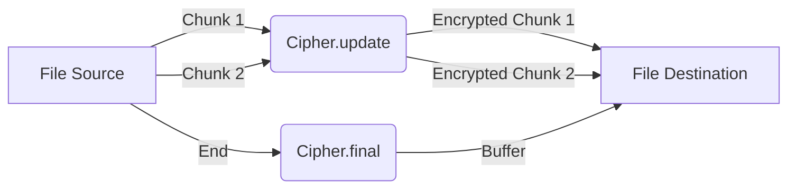

import { Step, Steps } from 'fumadocs-ui/components/steps';
import { Callout } from 'fumadocs-ui/components/callout';

# Encrypting Large Files

When encrypting large files (like videos or high-res images), loading the entire file into memory as a single `Buffer` or `string` will likely crash your app (OOM - Out Of Memory error).

To handle this, we process the file in **chunks** using `Cipher`'s streaming interface (`.update()`).

## The Concept

Instead of converting `File -> Buffer -> Encrypted`, we do:



## Implementation

This pattern works with any file system library (e.g., `react-native-fs`, `expo-file-system`, or `react-native-blob-util`). We'll use pseudocode for file IO.

<Steps>
<Step>
### Initialize Streaming Cipher

Create the cipher instance. It maintains internal state between updates, so reuse it for the whole stream.

```ts
import QuickCrypto from 'react-native-quick-crypto';

const key = QuickCrypto.randomBytes(32);
const iv = QuickCrypto.randomBytes(16); // AES-CBC needs 16 bytes

const cipher = QuickCrypto.createCipheriv('aes-256-cbc', key, iv);
```
</Step>

<Step>
### The Processing Loop

Read the file in manageable chunks (e.g., 1MB to 5MB).

```ts
const CHUNK_SIZE = 1024 * 1024; // 1MB chunks
let offset = 0;
const fileSize = await FileSystem.getSize(path);

// Open output stream/file
await FileSystem.write(outputPath, '', 'utf8'); // Clear file

while (offset < fileSize) {
  // Read Chunk
  const chunkBase64 = await FileSystem.read(path, { 
    position: offset, 
    length: CHUNK_SIZE, 
    encoding: 'base64' 
  });
  
  // Encrypt Chunk
  const encryptedHex = cipher.update(chunkBase64, 'base64', 'hex');
  
  // Write/Append Chunk
  await FileSystem.append(outputPath, encryptedHex, 'hex');
  
  offset += CHUNK_SIZE;
}
```
</Step>

<Step>
### Finalize

After the loop, call `.final()` to process any remaining internal buffer and padding. This step is critical!

```ts
// Finalize
const finalHex = cipher.final('hex');

if (finalHex.length > 0) {
  await FileSystem.append(outputPath, finalHex, 'hex');
}

console.log('Encryption Complete! 🔒');
```
</Step>
</Steps>

## Memory Usage Comparison

| Method | 500MB Video | RAM Usage | Outcome |
| :--- | :--- | :--- | :--- |
| **All-At-Once** | `cipher.update(fullFile)` | > 1.2 GB | **CRASH** 💥 |
| **Chunked** | `cipher.update(1MB)` | ~5 MB | **SUCCESS** ✅ |

<Callout type="warn" title="Production Readiness">
Handling critical user data requires robustness:
- **Integrity Checks**: Always calculate a Hash (SHA-256) of the file *while* encrypting to verify decryption later.
- **Resume Capability**: If the app crashes at 90%, you need logic to effectively resume or clean up partially written files.
- **Error Handling**: File I/O can fail (disk full, permissions). Wrap operations in try/catch blocks.
</Callout>
