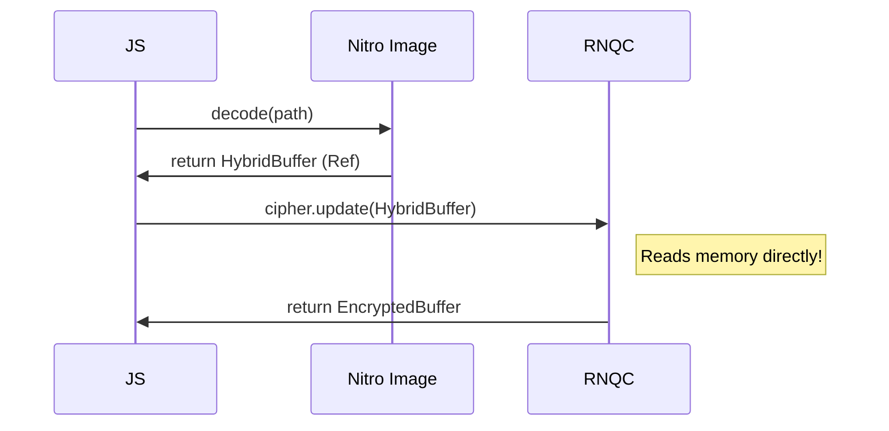

import { Callout } from 'fumadocs-ui/components/callout';

**RNQC** is built on the **Nitro Modules** architecture. This means it exposes JSI `HybridObjects` that can be shared across other Nitro libraries with zero serialization cost.

## Why Nitro?

Standard React Native modules send data as JSON strings over the Bridge.
*   **Bridge**: `ArrayBuffer` -> `Base64 String` -> `Bridge` -> `Base64 String` -> `Native Byte Array`. (Slow!)
*   **Nitro**: `ArrayBuffer` -> `JSI Reference` -> `Native Byte Array`. (Instant!)

## Sharing Buffers

When you use `randomBytes` or `Cipher`, you get a `Buffer`. In RNQC (and Nitro), this Buffer is backed by a shared C++ memory region.

You can pass this Buffer directly to other Nitro-powered libraries (like `react-native-nitro-image` or custom C++ modules) without copying data.

### Example: Encrypting an Image

Imagine you have `react-native-nitro-image` which returns a raw pixel buffer.



## Creating a Nitro Module that uses Crypto

If you are building your own [Nitro Module](https://github.com/mrousavy/nitro), you can accept `ArrayBuffer` in your schema.

```typescript
// MyModule.nitro.ts
export interface MyModule extends HybridObject<{ ios: 'c++', android: 'c++' }> {
  processSecureData(data: ArrayBuffer): void;
}
```

Then in your app:

```typescript
import { randomBytes } from 'react-native-quick-crypto';
import { MyModule } from 'my-module';

// Generate 1MB of random data
const bigKey = randomBytes(1024 * 1024); 

// Pass to your module
// This is virtually instant - no Base64 copy!
MyModule.processSecureData(bigKey.buffer);
```

## Ecosytem

RNQC plays well with:
*   **react-native-mmkv**: Fast, JSI-based storage.
*   **react-native-wishlist**: Fast layouts.
*   **react-native-skia**: High-performance graphics (can consume ArrayBuffers).

By sticking to the **JSI/Nitro** ecosystem, you ensure that expensive cryptographic operations never block the UI thread from receiving touch events.
