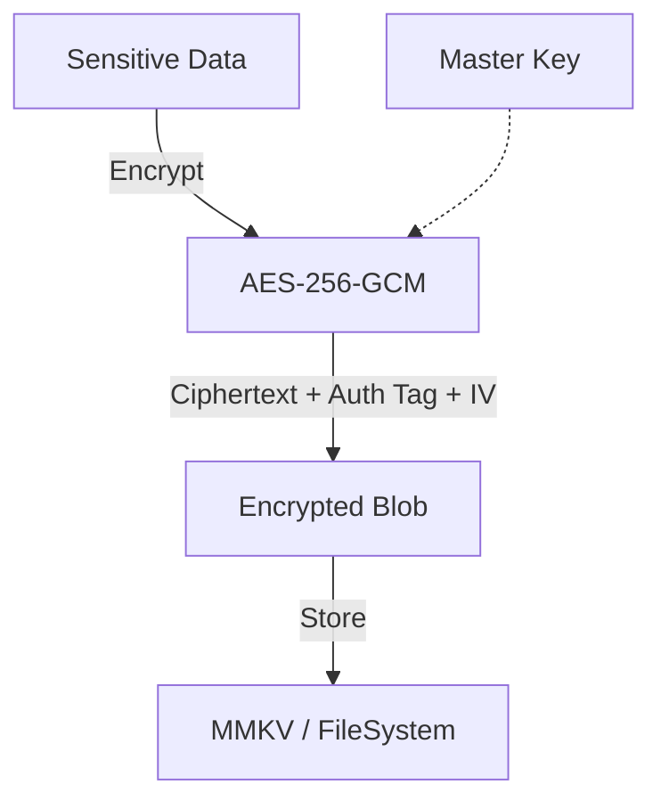

import { Callout } from 'fumadocs-ui/components/callout';
import { Step, Steps } from 'fumadocs-ui/components/steps';

Building a secure storage solution requires combining **strong encryption** (RNQC) with **fast persistence** (MMKV or FileSystem).

This guide shows how to build a production-grade encrypted storage wrapper.

## Architecture

We will implement an **Encrypt-then-Store** strategy using `AES-256-GCM`.

*   **Algorithm**: AES-256-GCM (Authenticated Encryption).
*   **Key Management**: The encryption key itself must be stored securely (e.g., in the Keychain/Keystore via `react-native-keychain` or `expo-secure-store`).
*   **Storage**: The encrypted blob is stored in `react-native-mmkv`.



## Implementation

<Steps>

<Step>
### Install Dependencies

We need storage and keychain libraries.

```bash
npm install react-native-mmkv react-native-keychain
```
</Step>

<Step>
### Create the Crypto Layer

This helper handles the raw encryption.

```ts
import { createCipheriv, createDecipheriv, randomBytes } from 'react-native-quick-crypto';
import { Buffer } from 'buffer';

const ALGORITHM = 'aes-256-gcm';

export const encryptData = (key: Buffer, data: string) => {
  const iv = randomBytes(12); // 96-bit IV for GCM
  const cipher = createCipheriv(ALGORITHM, key, iv);
  
  let encrypted = cipher.update(data, 'utf8', 'base64');
  encrypted += cipher.final('base64');
  const authTag = cipher.getAuthTag();

  // Return a combined payload
  return JSON.stringify({
    iv: iv.toString('base64'),
    tag: authTag.toString('base64'),
    content: encrypted
  });
};

export const decryptData = (key: Buffer, payloadStr: string) => {
  const { iv, tag, content } = JSON.parse(payloadStr);
  
  const decipher = createDecipheriv(
    ALGORITHM, 
    key, 
    Buffer.from(iv, 'base64')
  );
  
  decipher.setAuthTag(Buffer.from(tag, 'base64'));
  
  let decrypted = decipher.update(content, 'base64', 'utf8');
  decrypted += decipher.final('utf8');
  
  return decrypted;
};
```
</Step>

<Step>
### Integrate with MMKV

Now we wrap MMKV with this encryption layer.

```ts
import { MMKV } from 'react-native-mmkv';
import * as Keychain from 'react-native-keychain';
import { encryptData, decryptData } from './crypto-helper';
import { randomBytes } from 'react-native-quick-crypto';

const storage = new MMKV();

// Get or Create the Master Key
async function getMasterKey(): Promise<Buffer> {
  const credentials = await Keychain.getGenericPassword({ service: 'app-secret' });
  if (credentials) {
    return Buffer.from(credentials.password, 'hex');
  } 
  
  // Create new random key
  const newKey = randomBytes(32);
  await Keychain.setGenericPassword('master', newKey.toString('hex'), { service: 'app-secret' });
  return newKey;
}

// The Storage API
export const SecureStorage = {
  async set(key: string, value: string) {
    const masterKey = await getMasterKey();
    const encrypted = encryptData(masterKey, value);
    storage.set(key, encrypted);
  },
  
  async get(key: string) {
    const encrypted = storage.getString(key);
    if (!encrypted) return null;
    
    const masterKey = await getMasterKey();
    try {
      return decryptData(masterKey, encrypted);
    } catch (e) {
      console.error('Decryption failed - data tampering detected!');
      return null; // or throw
    }
  }
};
```
</Step>

</Steps>

## Why not just use MMKV encryption?

MMKV has built-in encryption, but it uses AES-CFB and requires the key to be passed during initialization. Managing that lifecycle on the native side can be complex.

**RNQC + MMKV** gives you:
1.  **Full Control**: You decide the algorithm (GCM is safer than CFB).
2.  **Key Rotation**: You can re-encrypt data with a new key easily in JS.
3.  **Portability**: This logic works with any storage backend (SQLite, Realm, FileSystem).

