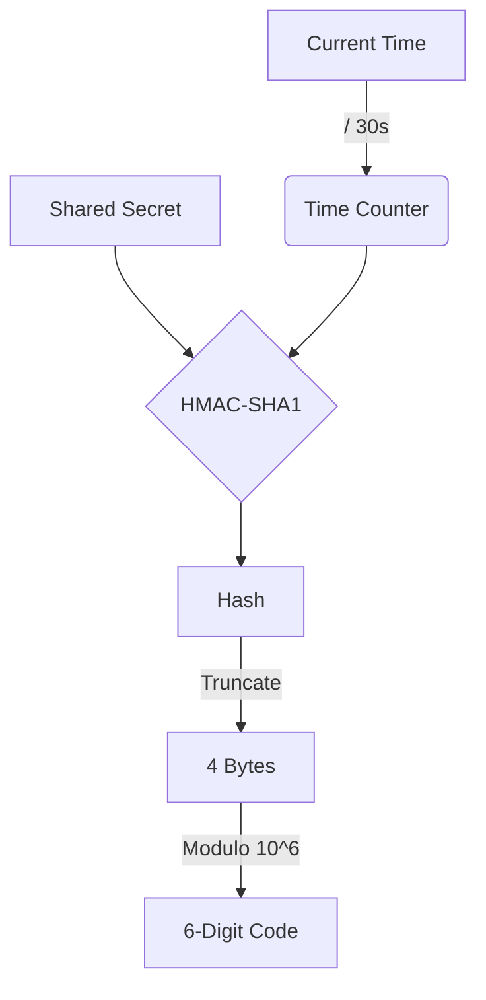

import { Step, Steps } from 'fumadocs-ui/components/steps';
import { Callout } from 'fumadocs-ui/components/callout';

# Building a 2FA Authenticator

Time-based One-Time Passwords (TOTP) are the industry standard for Two-Factor Authentication (RFC 6238). They are used by Google Authenticator, Authy, and almost every login system.

At its core, TOTP is just **HMAC-SHA1** hashing a **Secret Key** mixed with the **Current Time**.

## How It Works



## Implementation

We can implement a full TOTP generator using only `react-native-quick-crypto`.

<Steps>
<Step>
### The Time Counter

TOTP codes change every 30 seconds. We need to calculate the number of 30-second intervals since the Unix Epoch.

```ts
function getCounter(): Buffer {
  const time = Math.floor(Date.now() / 1000 / 30);
  const buffer = Buffer.alloc(8);
  
  // Write time as a Big-Endian 64-bit integer
  buffer.writeUInt32BE(0, 0);       // High 32 bits
  buffer.writeUInt32BE(time, 4);    // Low 32 bits
  
  return buffer;
}
```
</Step>

<Step>
### HMAC Hashing

Hash the counter with the user's secret key using **SHA-1** (standard for TOTP).

```ts
import QuickCrypto from 'react-native-quick-crypto';

function generateTOTP(secret: Buffer) {
  const counter = getCounter();
  const hmac = QuickCrypto.createHmac('sha1', secret);
  
  hmac.update(counter);
  const digest = hmac.digest(); // Returns Buffer
  
  return dynamicTruncation(digest);
}
```
</Step>

<Step>
### Dynamic Truncation

Extract 4 bytes from the hash to turn it into a number.

```ts
function dynamicTruncation(digest: Buffer): string {
  // Get the offset from the last nibble (0-15)
  const offset = digest[digest.length - 1] & 0x0f;

  // Read 4 bytes starting at the offset
  const binary =
    ((digest[offset] & 0x7f) << 24) |
    ((digest[offset + 1] & 0xff) << 16) |
    ((digest[offset + 2] & 0xff) << 8) |
     (digest[offset + 3] & 0xff);

  // Modulo 1,000,000 to get 6 digits
  const code = binary % 1000000;
  return code.toString().padStart(6, '0');
}
```
</Step>

<Step>
### Usage

```ts
// In real apps, decode the Base32 secret from the QR code first!
// calculating 'secret' from a string for demo purposes:
const secret = Buffer.from('MY_SECRET_KEY', 'utf8'); 

const code = generateTOTP(secret);
console.log(`Your 2FA code is: ${code}`); // "849102"
```

</Step>
</Steps>

<Callout type="warn" title="Production Readiness">
Implementing 2FA requires more than just generating codes. Consider:
- **Time Synchronization**: Devices might have incorrect clocks. Implement a "window" verification (check code ±1 step).
- **Backup Codes**: Users lose devices. Always provide static backup codes.
- **Rate Limiting**: Prevent brute-force attacks on your verification endpoint.
</Callout>
