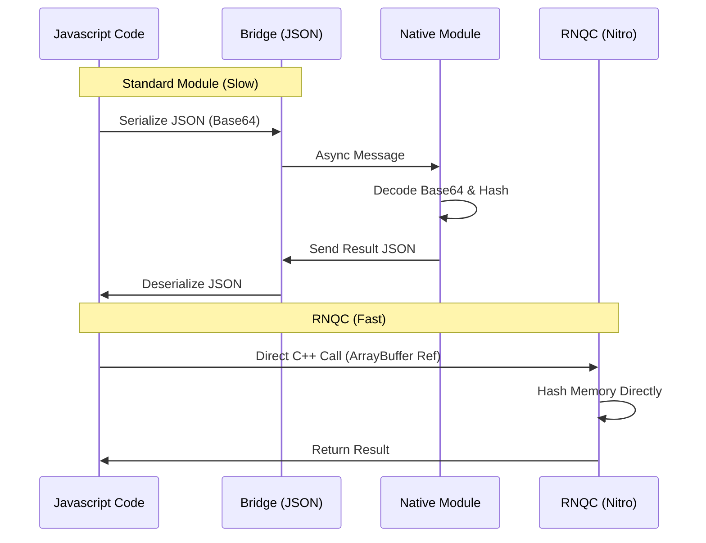

import { Check, X, AlertTriangle } from 'lucide-react';
import { Callout } from 'fumadocs-ui/components/callout';

RNQC is designed to be the faster, more complete alternative to existing solutions.

| Feature | RNQC | react-native-crypto | react-native-fast-crypto |
| :--- | :---: | :---: | :---: |
| **Performance** | **Nitro** (Native C++) | 🐢 Bridge (JS-shim) | ⚡️ JSI (Partial) |
| **Node.js API** | **1:1 Compatible** | Compatible | Custom API |
| **Sync Methods** | Fully Supported | Async Only | Supported |
| **Thread Safety** | **Off-Main-Thread** | Blocks JS Thread | Off-Main-Thread |
| **Maintenance** | **Active (Margelo)** | Abandoned | Stale |

---

## Visual Comparison

### Standard Bridge vs. RNQC Nitro

---

## Theory: Why is it faster?

The performance gap comes down to **Memory Access** and **Execution Model**.

### 1. Zero-Copy Buffers
Standard React Native modules (like `react-native-crypto`) communicate via the Bridge. To hash a 1MB file:
1.  **JS**: Converts Buffer to Base64 string (Costly).
2.  **Bridge**: Serializes msg to JSON. Used double memory.
3.  **Native**: Deserializes JSON, decodes Base64 to bytes.
4.  **Native**: Hashes bytes.

**RNQC (Nitro)**:
1.  **JS**: Holds a reference to an `ArrayBuffer`.
2.  **C++**: Reads that memory address directly. **Hash.**
3.  **Done.**

### 2. C++ Thread Pool
JSI allows us to define "Hybrid Objects" that can spawn their own C++ threads. We use a dedicated thread pool for heavy algorithms (like `scrypt` or `rsa keygen`), ensuring the main JS thread (and your UI) is never blocked, while avoiding the overhead of spawning new OS threads for every call.

---

# Benchmarks

Proof is in the numbers. We benchmarked RNQC against standard JS implementations (`browserify`) and other native libraries.

<Callout type="info">
  **Benchmark Philosophy**: This is not meant to disparage the other libraries. On the contrary, they perform amazingly well when used in a server-side Node environment or browser. This library exists because React Native does not have that environment nor the Node Crypto API implementation at hand. So the benchmark suite is there to show you the speedup vs. the alternative of using a pure JS library on React Native.
</Callout>

**Environment**: iPhone 15 Pro, iOS 17.

## 1. Hashing (BLAKE3)

BLAKE3 is optimized for speed. RNQC (via Nitro) processes large inputs **90x faster** than JS implementations.

| Operation | RNQC | @noble/hashes | Speedup |
| :--- | :--- | :--- | :--- |
| **32b input** | **105,397 ops/s** | 13,175 ops/s | **8x** 🚀 |
| **64KB input** | **1,307 ops/s** | 14 ops/s | **93x** 🚀 |
| **Streaming** | **39,208 ops/s** | 938 ops/s | **41x** 🚀 |

## 2. Encryption (AES-GCM / Salsa20)

Native encryption prevents frame drops. `AES-256-GCM` is over **100x faster** for large buffers.

| Operation | RNQC | JS / Browserify | Speedup |
| :--- | :--- | :--- | :--- |
| **XSalsa20 (64KB)** | **852 ops/s** | 7.39 ops/s | **115x** 🚀 |
| **AES-256-GCM (1MB)** | **177 ops/s** | 0.18 ops/s (browserify) | **962x** 🚀 |
| **AES-256-GCM (1MB)** | **177 ops/s** | 1.32 ops/s (@noble) | **134x** 🚀 |

## 3. Key Derivation (PBKDF2)

Password hashing is computationally expensive. Running this on the JS thread freezes the UI.

| Operation | RNQC | @noble/hashes | Speedup |
| :--- | :--- | :--- | :--- |
| **PBKDF2 (async)** | **52,948 ops/s** | 1,447 ops/s | **36x** 🚀 |
| **PBKDF2 (sync)** | **76,601 ops/s** | 1,459 ops/s | **52x** 🚀 |

## 4. Signatures (Ed25519)

Essential for crypto wallets. Verify signatures instantly without lag.

| Operation | RNQC | @noble/curves | Speedup |
| :--- | :--- | :--- | :--- |
| **Sign/Verify (async)** | **9,917 ops/s** | 60 ops/s | **164x** 🚀 |
| **Sign/Verify (sync)** | **17,108 ops/s** | 60 ops/s | **285x** 🚀 |

## 5. HKDF

Standard key derivation is **over 100x faster**.

| Operation | RNQC | @noble/hashes | Speedup |
| :--- | :--- | :--- | :--- |
| **HKDF (async)** | **65,792 ops/s** | 582 ops/s | **112x** 🚀 |
| **HKDF (sync)** | **70,918 ops/s** | 572 ops/s | **123x** 🚀 |

## 6. Scrypt (Memory Hard)

Scrypt is a memory-hard key derivation function, making it incredibly slow in pure JavaScript. Native implementation provides massive gains.

| Operation | RNQC | @noble/hashes | Speedup |
| :--- | :--- | :--- | :--- |
| **scrypt (async)** | **1,791 ops/s** | 2.98 ops/s | **601x** 🚀 |
| **scrypt (sync)** | **2,160 ops/s** | 3.10 ops/s | **696x** 🚀 |
