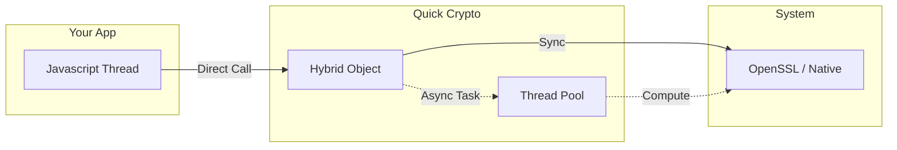

import { Step, Steps } from 'fumadocs-ui/components/steps';
import { Tab, Tabs } from 'fumadocs-ui/components/tabs';
import { Callout } from 'fumadocs-ui/components/callout';
import { Card, Cards } from 'fumadocs-ui/components/card';

## Introduction

**React Native Quick Crypto** (also known as **RNQC**) is the fastest, next-generation cryptography library for React Native. It is designed to be a drop-in replacement for all other React Native crypto libraries and is inspired by the Node.js `crypto` module, powered by a high-performance C++ JSI binding that executes directly on the native thread.


import { Zap, Server, ShieldCheck, Cpu } from 'lucide-react';

<Cards>
  <Card
    icon={<Zap />}
    href="/docs/introduction/performance"
    title="High Performance"
    description="Up to 60x faster than standard native bridges using JSI."
  />
  <Card
    icon={<Server />}
    href="/docs/introduction/comparison"
    title="Node.js Compatible"
    description="A complete implementation of the standard Node.js crypto API."
  />
  <Card
    icon={<ShieldCheck />}
    href="/docs/introduction/what-is-rnqc"
    title="Secure by Design"
    description="Operations run on a dedicated thread pool to keep the UI smooth."
  />
  <Card
    icon={<Cpu />}
    href="/docs/guides/nitro-integration"
    title="Nitro Powered"
    description="Built on Nitro Modules for zero-overhead native communication."
  />
</Cards>

<Callout type="info" title="Deep Dive">
  Want to understand the architecture? Read our in-depth guide: [What is RNQC?](/docs/introduction/what-is-rnqc)
</Callout>

## Terminology

Before we proceed, a few key concepts:

- **JSI (JavaScript Interface)**: A direct C++ interface to the JS runtime, bypassing the slow React Native Bridge.
- **Native Thread**: The thread where C++ code executes. We offload heavy crypto work here to prevent UI freezes.
- **Polyfill**: We provide a seamless global `crypto` object, just like in a browser or Node.js environment.

### Architecture At a Glance

RNQC is unique because it uses a **Hybrid Object** model. It lives on both the Javascript thread and the Native thread simultaneously.


---

## Automatic Installation

Follow these steps to integrate Quick Crypto into your React Native project.

<Steps>
  <Step>
    ### Install the Package
    
    Add the dependency using your preferred package manager.

    <Tabs items={['npm', 'yarn', 'pnpm', 'bun']}>
      <Tab value="npm">
        ```bash
        npm install react-native-quick-crypto
        ```
      </Tab>
      <Tab value="yarn">
        ```bash
        yarn add react-native-quick-crypto
        ```
      </Tab>
      <Tab value="pnpm">
        ```bash
        pnpm add react-native-quick-crypto
        ```
      </Tab>
      <Tab value="bun">
        ```bash
        bun add react-native-quick-crypto
        ```
      </Tab>
    </Tabs>
  </Step>
 
  <Step>
    ### iOS Setup (Cocoapods)
    
    If you are developing for iOS, navigate to your `ios` directory and install the pods.

    ```bash
    cd ios && pod install
    ```
  </Step>

  <Step>
    ### Rebuild the App
    
    Since this library includes native C++ code, you must rebuild your native binary.

    <Tabs items={['Android', 'iOS']}>
      <Tab value="Android">
        ```bash
        npx react-native run-android
        ```
      </Tab>
      <Tab value="iOS">
        ```bash
        npx react-native run-ios
        ```
      </Tab>
    </Tabs>

    <Callout type="warn">
      Don't forget: You **cannot** use this library with Expo Go. You must use a Development Build or straight React Native.
    </Callout>

  </Step>
</Steps>


## Create your first cryptographic operation

Once installed, usage is straightforward. The API mirrors Node.js exactly.

```tsx title="App.tsx"
import React, { useEffect } from 'react';
import QuickCrypto from 'react-native-quick-crypto';

// Polyfill global.crypto for full compatibility
QuickCrypto.install();

export default function App() {
  useEffect(() => {
    // Standard Node.js API (SHA-256)
    const hash = QuickCrypto.createHash('sha256')
      .update('Hello World')
      .digest('hex');
    console.log('SHA-256:', hash);
    
    // High-Performance Random Bytes (Native JSI)
    const randomBuffer = QuickCrypto.randomBytes(16);
    console.log('Random:', randomBuffer.toString('hex'));

    // Next-Gen Algorithms (BLAKE3)
    const b3Hash = QuickCrypto.blake3('Fastest Hash', { dkLen: 32 });
    console.log('BLAKE3:', Buffer.from(b3Hash).toString('hex'));
  }, []);

  return null;
}
```

<Callout title="Why Polyfill?">
  React Native does not provide a native `crypto` implementation or a global `Buffer` environment. 
  
  Calling `QuickCrypto.install()` injects our high-performance C++ bindings into `global.crypto` and `global.Buffer`. This is essential because many popular libraries (like `ethers`, `jsonwebtoken`, or `viem`) rely on these Node.js standard APIs to function correctly.
</Callout>


## For Expo Users

Quick Crypto includes a **Config Plugin** for Expo.

Add the plugin to your `app.json` or `app.config.js`:

```json title="app.json"
{
  "expo": {
    "plugins": [
      ["react-native-quick-crypto", { "sodiumEnabled": true }] // Optional configuration
    ]
  }
}
```

Then rebuild your development client:

```bash
npx expo prebuild
npx expo run:ios
```

---

## FAQ

<div className="flex flex-col gap-4">
  <details className="group border border-fd-border rounded-lg p-4 open:bg-fd-accent/10">
    <summary className="font-medium cursor-pointer list-none">
      Does this work with Expo Go?
    </summary>
    <div className="mt-2 text-fd-muted-foreground">
      No. Expo Go does not support custom native modules. You must use a **Custom Development Client** (CNG) or `npx expo prebuild`.
    </div>
  </details>

  <details className="group border border-fd-border rounded-lg p-4 open:bg-fd-accent/10">
    <summary className="font-medium cursor-pointer list-none">
      Is it faster than `react-native-crypto`?
    </summary>
    <div className="mt-2 text-fd-muted-foreground">
      Yes, significantly. We use direct C++ JSI bindings instead of the React Native Bridge, which eliminates serialization overhead.
    </div>
  </details>
</div>

---

## Learn More

New here? Don't worry, we welcome your questions.

If you find anything confusing or have suggestions, please give your feedback on our **GitHub Discussions**.

[Join the Discussion](https://github.com/margelo/react-native-quick-crypto/discussions)
