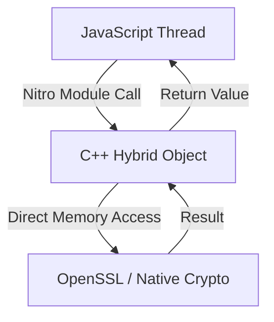

import { Check, X } from 'lucide-react';

**RNQC** (also known as React Native Quick Crypto) is a cryptography library for React Native compatible with Node's `crypto` API, differing from other libraries by being a complete re-implementation rather than just a fast wrapper. Developed by [Margelo](https://margelo.com), it is built entirely on C++ JSI bindings to provide direct, synchronous access to native cryptographic primitives.

## Why was it created?

React Native has historically lacked a robust, high-performance cryptographic standard. Developers largely relied on slower JS-only polyfills or incomplete wrappers.

**RNQC was created because complex apps need a FULL, INDEPENDENT cryptographic standard.**

We wanted a complete, standalone cryptographic library for React Native where you can simply call `install()` to polyfill the environment, ensuring all your cryptographic operations run smoothly and **hundreds of times faster** than standard JS solutions.

<Callout type="info" title="Built by Margelo">
  This library was built at **Margelo**, an elite app development agency, specifically to power high-performance crypto apps and wallets.
</Callout>

---

## Philosophies

### 1. Seamless Integration
We believe improved performance shouldn't require code rewrites. 
RNQC implements the **exact** Node.js API surface. If you know Node `crypto`, you know RNQC. There is zero learning curve.

### 2. Performance First (Nitro Modules)
We bypass the "Bridge". All operations communicate directly with C++ via **Nitro Modules**, a modern architecture built on top of JSI (JavaScript Interface).
Heavy tasks (like `pbkdf2` or key generation) are offloaded to a dedicated native thread pool to ensure your UI **never freezes**, even during intensive encryption.

### 3. Secure Defaults
We don't roll our own crypto. All primitives map directly to the platform-native, battle-tested **OpenSSL** library:
- **Android**: OpenSSL (bundled or system)
- **iOS**: OpenSSL (via CocoaPods)

## Architecture

RNQC bridges the gap between the JavaScript world and native C++ performance using **Nitro Modules**.

### Nitro Modules Architecture
Unlike the legacy Bridge, which relies on asynchronous JSON message passing (slow, serializable-only), **Nitro Modules** provides a modern architecture built on JSI (JavaScript Interface), allowing C++ code to expose "Hybrid Objects" directly to the JavaScript runtime.
1.  **Zero Serialization**: Data (like `ArrayBuffer`) is shared by reference. No cloning large buffers.
2.  **Synchronous Execution**: Methods like `randomBytes` or `update` run instantly, just like native JS functions.
3.  **Thread Safety**: Heavy operations automatically offload to a C++ thread pool to prevent UI jank.

---

## When to use RNQC?

| Scenario | Use RNQC? | Why? |
| :--- | :---: | :--- |
| **Web3 / Blockchain** | <Check className="text-green-500" /> | Essential for wallet generation, signing transactions, and hashing (Keccak/SHA) securely and quickly. |
| **Auth (JWT/Jose)** | <Check className="text-green-500" /> | Drastically speeds up token verification and signing compared to JS-only implementations. |
| **End-to-End Encryption** | <Check className="text-green-500" /> | Using standard algorithms (AES-GCM, RSA) on the native thread prevents UI jank. |
| **Simple Random Strings** | <Check className="text-green-500" /> | `randomBytes` is cryptographically secure (CSPRNG), unlike `Math.random()`. |
| **UI-Only Apps** | <X className="text-red-500" /> | If your app has zero security or hashing requirements, you probably don't need this. |
