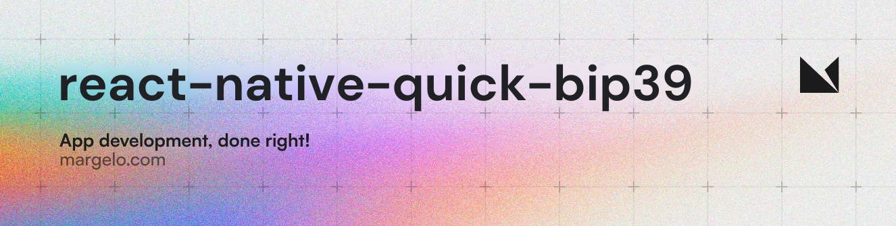

<a href="https://margelo.com">
  <picture>
    <source media="(prefers-color-scheme: dark)" srcset="./assets/img/banner-dark.png" />
    <source media="(prefers-color-scheme: light)" srcset="./assets/img/banner-light.png" />
    
  </picture>
</a>

# ⚡️ react-native-quick-bip39

A high-performance, lightweight, and type-safe **BIP39** implementation for React Native, built on top of `react-native-quick-crypto`.

## Features

- ⚡️ **Blazing Fast**: **~100x faster** mnemonic-to-seed generation than JS alternatives by offloading PBKDF2 to C++ via RNQC.
- 📦 **Modular & Lightweight**: Designed with a "pay-for-what-you-use" architecture.
  - **~19 KB** default bundle size (English only).
  - Multi-language support is tree-shakeable.
- 🔢 **Standard Compliant**: Fully supports all 10 BIP39 languages with correct delimiters (e.g., Japanese `\u3000`).
- 🛡️ **Type-Safe**: Written in strict TypeScript.

## Installation

<h3>
  React Native  <a href="#"></a>
</h3>

```bash
npm install react-native-quick-bip39 react-native-quick-crypto
# or
yarn add react-native-quick-bip39 react-native-quick-crypto
```

> **IMPORTANT**: This package depends on `react-native-quick-crypto`.
> You **MUST** install and configure it correctly for this package to work.
> Please follow the [RNQC Complete Setup Guide]([prod-docs]/docs/introduction/complete-setup).

## Usage

### Basic Usage (English)

```typescript
import { 
  generateMnemonic, 
  mnemonicToSeed, 
  validateMnemonic 
} from 'react-native-quick-bip39';

// 1. Generate a 12-word mnemonic (128-bit entropy)
const mnemonic = generateMnemonic(128); 
// "orphan fresh utility slice magnet believe..."

// 2. Validate a mnemonic
const isValid = validateMnemonic(mnemonic); // true

// 3. Convert to Seed (Async - Recommended to keep UI responsive)
// Uses native C++ thread pool
const seed = await mnemonicToSeed(mnemonic, 'optionalPassword');

// 4. Convert to Seed (Synchronous - Uses native C++ JSI direct call)
const seedSync = mnemonicToSeedSync(mnemonic);
```

### Multi-Language Support

To keep bundle sizes small, non-English wordlists are **not** imported by default. You must import them explicitly.

```typescript
import { generateMnemonic } from 'react-native-quick-bip39';
import { wordlist as spanish } from 'react-native-quick-bip39/wordlists/spanish';
import { wordlist as japanese } from 'react-native-quick-bip39/wordlists/japanese';

// Generate Spanish Mnemonic
const spanishMnemonic = generateMnemonic(128, spanish);

// Generate Japanese Mnemonic (Uses proper \u3000 delimiter)
const japaneseMnemonic = generateMnemonic(128, japanese);
```

## API Dictionary

### `generateMnemonic(strength?: number, wordlist?: string[])`
*   `strength`: Entropy bits (128, 160, 192, 224, 256). Default: `128` (12 words).
*   `wordlist`: Array of 2048 words. Default: `english`.
*   Returns: `string` (space-separated mnemonic).

### `validateMnemonic(mnemonic: string, wordlist?: string[])`
*   Checks valid word count, wordlist existence, and checksum.
*   Returns: `boolean`.

### `mnemonicToSeed(mnemonic: string, password?: string)`
*   Async derivation using PBKDF2 (SHA-512).
*   Returns: `Promise<Buffer>`.

### `entropyToMnemonic(entropy: Buffer, wordlist?: string[])`
*   Converts raw entropy to mnemonic.

## Bundle Size Impact

| Usage | Bundle Size (Minified) |
|-------|------------------------|
| **English Only (Default)** | **~19 KB** |
| All Languages | ~283 KB |

## Adoption at Scale

`react-native-quick-bip39` is built at Margelo, an elite app development agency. For enterprise support or other business inquiries, contact us at <a href="mailto:hello@margelo.io?subject=Adopting react-native-quick-bip39 at scale">hello@margelo.io</a>!

## License

MIT
